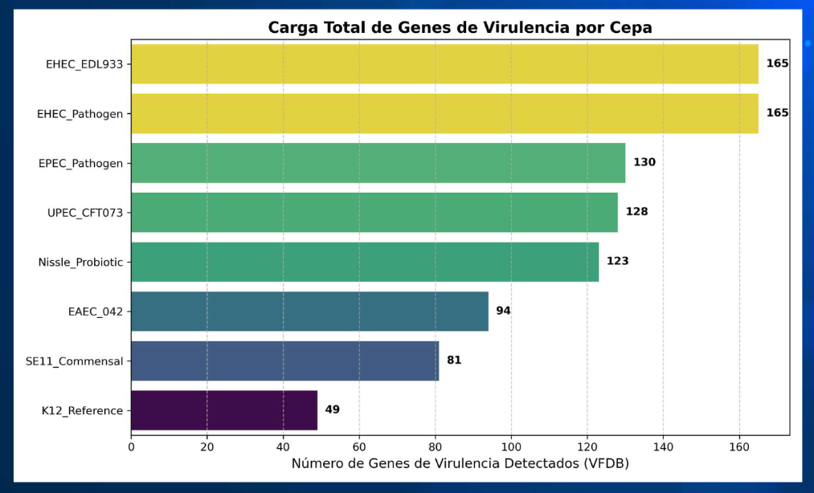
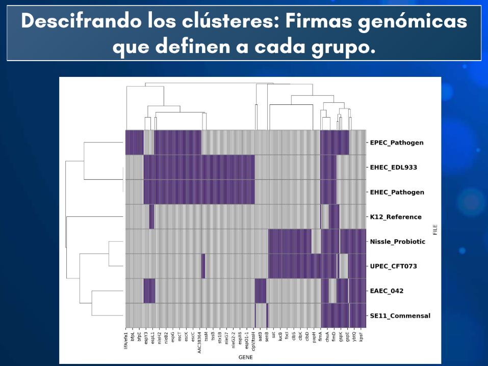
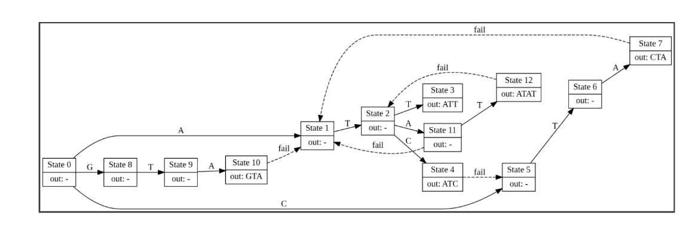

# Computational Genomics
**Faculty of Science, UNAM**

Repository containing laboratory practices, theoretical assignments, and the final project for the Computational Genomics course (Group 7145), taught by **M. Sc. Sergio Hernández López**.

**Student:** Juan Mario Sosa Romo

## Repository Structure

The content is divided into three main academic components: bibliographic research, theoretical problem solving, and bioinformatics software development.

### 1. Final Project: Comparative Analysis of *E. coli* Strains
Directory: `Proyecto/`

Computational study focused on the genomic differences and similarities between various *Escherichia coli* strains. The project involves identifying virulence factors and performing gene counts using custom Python scripts.

* **Methodology:**
    * Sequence download and validation (`accessions.txt`, `md5sum.txt`).
    * Generation of distance matrices and Heatmaps.
    * Visualization of genomic data.
* **Scripts (Python):**
    * `plot_counts.py`: Generation of gene count plots.
    * `plot_matrix.py`: Visualization of similarity/virulence matrices.
    * `util.py`: Helper functions for data processing.

    

 

    

### 2. Laboratory & Seminars
Directory: `Lab/`

Collection of scientific article analyses and presentations regarding genetic disorders and proteomics.

* **Selected Topics:**
    * Genetic analysis of Albinism.
    * Swyer Syndrome: Chromosomal and molecular bases.
    * Protein structure and function (Presentation).

### 3. Assignments & Foundations
Directory: `Tareas/`

Resolution of theoretical and practical exercises on genomic algorithms and computational molecular biology.

    

---
